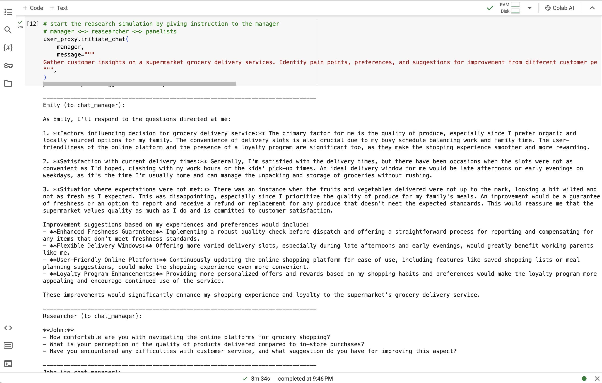

# Synthetic User Research
## Using AI and Autonomous Agents with the Autogen Framework

## Overview

This project introduces a new approach to user research by using AI and automated agents to create and interact with digital customer personas. Traditional user research methods can be limited by their ability to scale and their access to diverse user groups. Our method overcomes these challenges by simulating digital personas in research scenarios, providing valuable insights into customer behaviors and preferences. You can also check out an example report card [here](EXAMPLE_REPORT.md).



## Key Features

- **Persona Prompting**: Creating detailed prompts to develop synthetic personas with rich backgrounds, goals, and frustrations.
- **Autonomous Agent Interaction**: Combining technology and language to simulate real consumer interactions with digital personas.
- **Advanced Research Tools**: Using frameworks like Autogen, BabyAGI, and CrewAI to manage complex agent systems and interactions.

## Getting Started

### Prerequisites

- Python 3.8 or later
- Autogen and other required libraries installed

### Installation

Clone the repository to your local machine:

```bash
git clone https://github.com/imnot4real/synthetic-user-research.git
cd synthetic-user-research
```

### Running the Notebook

Open the Jupyter Notebook in your preferred environment, such as Jupyter Lab or Google Colab. The notebook provides step-by-step instructions and code for setting up the environment, configuring the LLM and API keys, and running the synthetic user research simulations.

## Usage

Follow the notebook instructions to:

1. Set up your environment and configure the Large Language Model (LLM).
2. Define personas using the persona prompting method.
3. Initialize autonomous agents and simulate user research sessions.
4. Analyze the results and generate summaries with a Summary Agent.

## Contributing

We welcome your contributions! Whether you want to add new features, improve documentation, or report issues, your help is appreciated. Please submit pull requests or open issues on GitHub.

## License

This repository is licensed under the [CC BY-NC-SA 4.0](LICENSE). For more details, see the LICENSE file or visit [Creative Commons](http://creativecommons.org/licenses/by-nc-sa/4.0/).

This license requires giving credit to the creator and allows others to remix, adapt, and build upon the material for noncommercial purposes only. Any modifications must be licensed under the same terms.

## Acknowledgments

- Stefano De Paoli for the research paper and process documentation on persona generation.
- The Autogen, BabyAGI, and CrewAI frameworks for their role in creating autonomous agents.
- Vincent Koc for his article on [Towards Data Science](https://towardsdatascience.com/creating-synthetic-user-research-using-persona-prompting-and-autonomous-agents-b521e0a80ab6).
